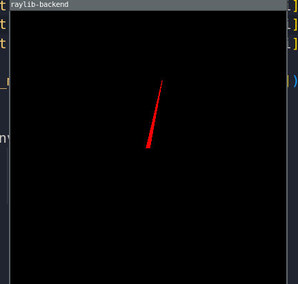
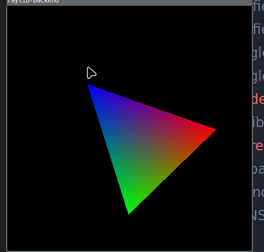
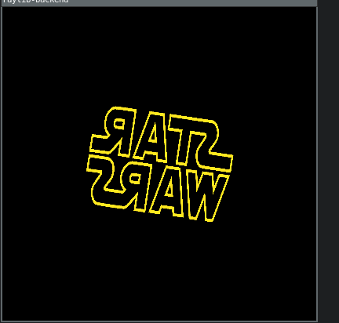
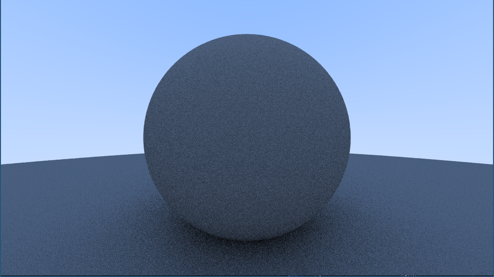
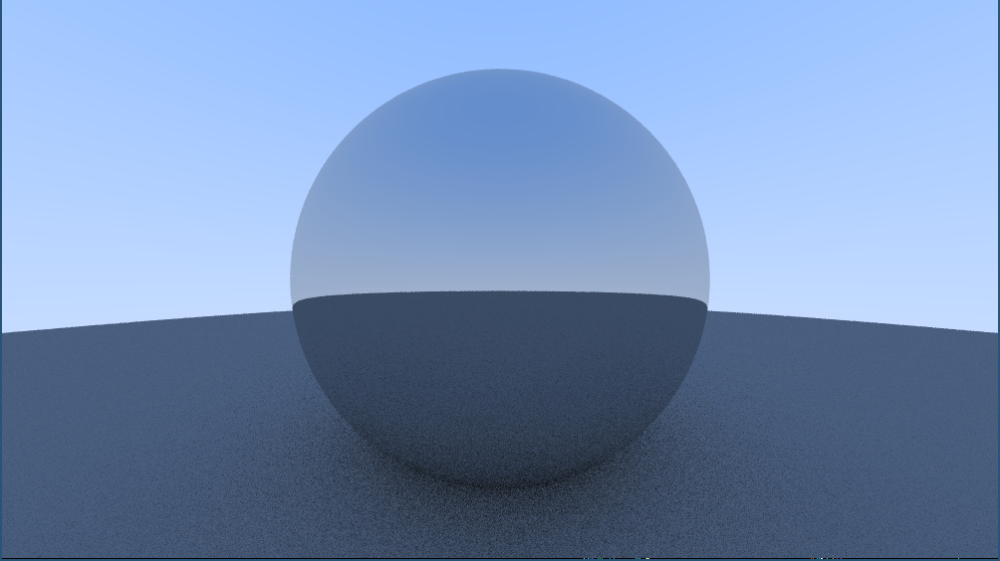
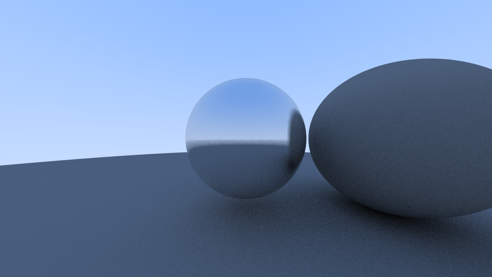
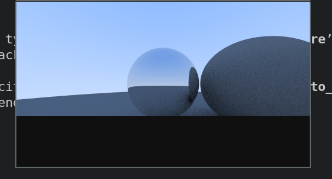

# Sft Renderer
basic software renderer, smthing like olivec from tsoding.    

# Major Resources
-   [software rendering thebennybox videos](https://www.youtube.com/watch?v=v7nrzvd9A5c&list=PLEETnX-uPtBUbVOok816vTl1K9vV1GgH5&index=5&ab_channel=thebennybox)
-   [Computer graphics from scratch](gabrielgambetta.com/computer-graphics-from-scratch/01-common-concepts.html)
-   [scratchapixel](https://www.scratchapixel.com/index.html)

## Dev Imgs
**Appling matrix lib**    
     
**Barycentric cords in action**     
      
**Texture Mapping**       

**[Raytacer in one weekend](https://raytracing.github.io/books/RayTracingInOneWeekend.html)**

 